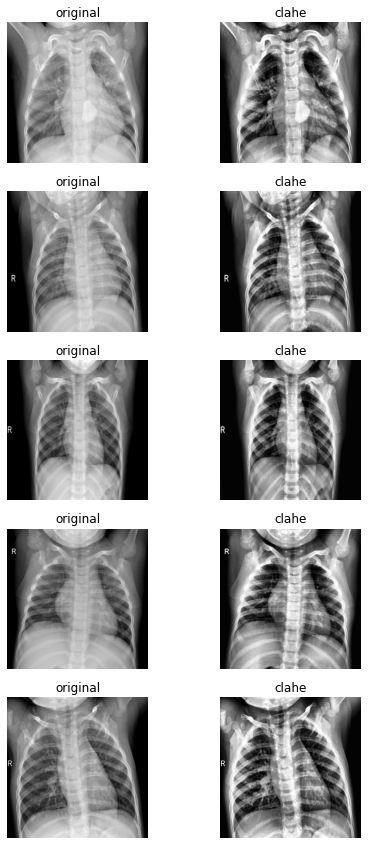
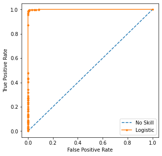

# COVID-19 Detection with Radiography Images

This is a project assignment for course WID3008 Image Processing. The objective of the project is as follow:
1. To classify whether a given chest x-ray image is infected by COVID-19 or is a normal chest x-ray image
2. To evaluate the accuracy of COVID-19 classification for chest x-ray images

More detailed information at the [Jupyter Notebooks](./notebooks)

## Requirements
`pip install -r requirements.txt` or `conda env create -f conda_env.yml`

## Datasets
Datasets are obtained from [Kaggle](https://www.kaggle.com/tawsifurrahman/covid19-radiography-database)

Below are a few training examples:
### COVID-19

### NORMAL

## Data Preprocessing
The preprocessing steps are defined as follow:

Below is a few images comparison showing the output of CLAHE:

 

## Model Definition
We use the InceptionV3 base model and add our own classifier dense layer to it to predict our binary image class.
Training steps are as follow:
1. Freeze base InceptionV3 model and train network head with Adam optimizer
2. Unfreeze a few inception block and train using SGD with low learning rate

## Results
### Epoch Plots

### Confusion Matrix

### ROC Curve

### Guided GradCAM

## References
1. https://www.kaggle.com/tawsifurrahman/covid19-radiography-database
2. https://keras.io/api/applications/
3. https://github.com/ismailuddin/gradcam-tensorflow-2
